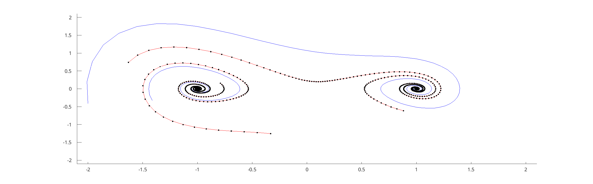

# pqEDMDm

pqEDMD Matlab: Repository for the development of the pqEDMD algorithm in Matlab.
Original version and citation:

[Garcia-Tenorio, C.; Vande Wouwer, A. A Matlab Toolbox for Extended Dynamic Mode Decomposition Based on Orthogonal Polynomials and p-q Quasi-Norm Order Reduction. Mathematics 2022, 10, 3859. https://doi.org/10.3390/math10203859](https://www.mdpi.com/2227-7390/10/20/3859)

The pqEDMD is an evolution of the extended dynamic mode decomposition (EDMD) algorithm. The premise is to use a p-q-quasi norm reduction method to select the orders of the polynomials. From the orders, the products of univariate polynomials create the set of _observables_ that _extend_ the measurements of the system, and provide the possibility of having an operator on this set of functions. And finally, the action of the operator on the set of functions is related to the evolution of the states in a nonlinear system.

Consider an arbitrary nonlinear system $(\mathcal{M};\mathcal{U};T(x);k)$,

$$
\begin{align}
 x(k+1) &= T(x(k)) + Bu\\
   y(k) &= C x(k) + Du(k)
\end{align}
$$

- $x\in\mathcal{M}\subseteq\mathbb{R}^{n}$ is the state.
- $u\in\mathcal{U}\subseteq\mathbb{R}^{m}$ is the input.
- $y\in\mathcal{Y}\subseteq\mathbb{R}^{l}$ is the output space.
- $k\in\mathbb{Z}_{0}^{+}$ is the discrete time.
- $T\colon{}\mathcal{M}\rightarrow{}\mathcal{M}$ is the nonlinear transition operator.
- $B\in\mathbb{R}^{n\times m}$ is the input-to-state matrix.
- $C\in\mathbb{R}^{l\times n}$ is the state-to-output matrix.
- $D\in\mathbb{R}^{l\times m}$ is the input-to-output matrix.

## Installation

Add all the files to your Matlab path

## Minimal Working Example

Consider a Duffing oscillator, where the differential equation of the system is,

$$
\begin{align}
	\dot{x}_1(t)&=x_2(t)\\
	\dot{x}_2(t)&=-\delta{}x_2(t)-x_1(t)(\beta+\alpha{}x_1^{2}(t)). \\
y(t) &=x(t)
\end{align}
$$

After integrating the system from six arbitrary initial conditions, and selecting two of those trajectories as the training set, and the remaining for testing, the result of plotting the states against each other is:

From the sample trajectories, apply the algorithm with a `legendreObservable` and a `pqDecomposition`, that implements a traditional
least squares regression. The result of the approximation is:

## Second Example

Consider the same Duffing oscillator with a forcing signal $u=\cos(\omega t)$ on the second state, i.e.,

$$
\begin{align}
	\dot{x}_1(t)&=x_2(t)\\
	\dot{x}_2(t)&=-\delta{}x_2(t)-x_1(t)(\beta+\alpha{}x_1^{2}(t)) + \cos(\omega t). \\
y(t) &=x(t)
\end{align}
$$

After selecting two trajectories for the estimating the system, four to test the result, and performing the approximation with a `legendreObservable` and a `svdDecomposition` gives the following results:

## TODO

The current architecture for a decomposition is not versatile for extending to another type of decomposition different from LSQ.

- [x] Change the architecture of the code.
- [x] The observable and type of decomposition should enter the pqEDMD as an argument and become an attribute (property)
- [x] Remove the huge p matrix functionality.
- [ ] Finish the sidDecomposition.
- [ ] Complete the documentation.
