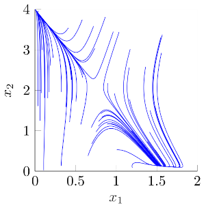
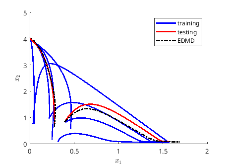

# Bioreactor

This example shows how the different algorithms perform for a simple continuous stirred-tank reactor (CSTR).

In the reactor there is a biomass that reproduces and multiplies in the presence of a substrate. The material balances in the reactor are:

$$
\begin{align}
V\dot{x}_1 & = F_{in}x_{1,f} - F_{out}x_1 + Vr_1\\
V\dot{x}_2 & = F_{in}x_{2,f} - F_{out}x_2 - Vr_2,
\end{align}
$$

where $V$ is the reactor volume, $x_1$ is the first state, representing the biomass concentration, $x_2$ is the second state, representing the substrate concentration, $F_{in}$ is the input volumetric flowrate, $x_{i,f}$ for $i=\{1,\;2\}$ are the respective state concentration at the input, $F_{out}$ is the output volumetric flowrate, and $r_i$ are the biomass production rate and substrate consumption rate.

The production rates come from the product of the growth rates and the
concentration of either species or substrate. For the species $x_1$, the
production rate is,

$$
r_1 = \mu x_1,
$$

where $\mu$ is the growth rate. In this
example, we will consider a Monod growth rate with substrate inhibition,

$$
\mu = \frac{\mu_{\text{max}}x_2}{k_m+x_2+k_1x_2^2},
$$

where $\mu_{\text{max}}$ is the specific growth trate, $k_m$ is the Monod saturation, and $k_1$ is the inhibition constant. In addition, define the process yield as the ratio between
biomass growth-rate and the rate of substrate consumption $Y=r_1/r_2$.
Finally, assuming a constant yield, a constant volume, an input feed
without any biomass concentration, and a dilution rate
$D=F/V\;[h^{-1}]$. The differential equation that describes the dynamics
of the biochemical reactor is,

$$
\begin{aligned}
\dot{x_1} & = x_1(\mu - D)\\
\dot{x_2} & = D(x_{2,f}-x_2) - \frac{\mu x_1}{Y} ,
\end{aligned}
$$

The following table shows the values for the different constants for the simulation of the reactor.

| **Symbol**         | **Value** |
| ------------------ | --------- |
| $\mu_{\text{max}}$ | 0.4       |
| $k_m$              | 0.12      |
| $k_1$              | 0.4545    |
| $Y$                | 0.4       |
| $x_{2,f}$          | 4.0       |

Analyzing the differential equation, it is clear that the reactor has two possible asymptotically stable (AS) fixed pints, i.e., where the derivatives are zero and the trajectories asymptotically converge: the working point, where the biological species thrives and the wash-out point, where the species dies. The existence and location of these fixed points depends on the parameters of the reactor and the value of the dilution rate. For example, fixing the dilution rate $D=0.2\;[h^{-1}]$, and applying it as a step response gives as a result a phase plane where the aforementioned points are evident. The next figure shows trajectories from 60 randomly selected initial conditions in the interval $x_0\in (0,\;1.58]\times(0,\;4]$. In addition to this behavior, the system can have a unique AS point, at the extremes. A low value of the dilution rates makes the saddle in between the AS points collapse with the wash-out point, leaving only the working point, and a high value of the dilution rate, produces the opposite. Therefore, it is important, when producing the artificial data to test the algorithms, to include as many of the different cases as necessary. Finally, to be consistent with _reality_, we will restrict the range of initial conditions to the cases where the initial species concentration is low, i.e., $x_0\in (0,\;0.5]\times(0,\;1]$.

The samples will come from integrating the system from 10 initial conditions, each with a constant dilution rate within the stablished ranges in Section~\ref{sub:small_reactor_example}, a final time of 50[h], and 501 points per \textit{experiment}. The following table gives a summary of the initial conditions, the dilution rate, and the selection of the experiment for either approximation or cross validation, the so-called training and testing sets. Figure~\ref{fig:phase_plane_trts} shows the corresponding trajectories for training, testing, and the approximation given by the pqEDMD with parameters p=4, q=2, resulting in 17 observables, with an empirical error over the testing set $\varepsilon=0.3771$.

| IC ($x_1$, $x_2$) | Dilution | Purpose  |
| ----------------- | -------- | -------- |
| (0.45, 0.54)      | 0.24     | training |
| (0.31, 0.05)      | 0.09     | training |
| (0.39, 0.81)      | 0.12     | training |
| (0.22, 0.99)      | 0.24     | training |
| (0.27, 0.64)      | 0.26     | testing  |
| (0.21, 0.94)      | 0.10     | training |
| (0.05, 0.73)      | 0.27     | training |
| (0.39, 0.82)      | 0.15     | testing  |
| (0.24, 0.12)      | 0.22     | training |
| (0.03, 0.73)      | 0.10     | training |

